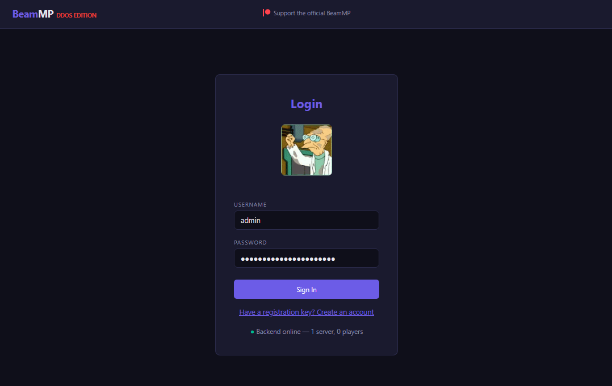
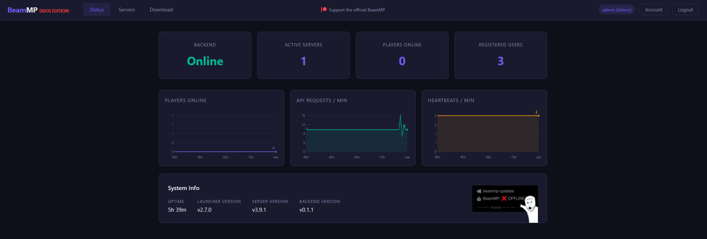
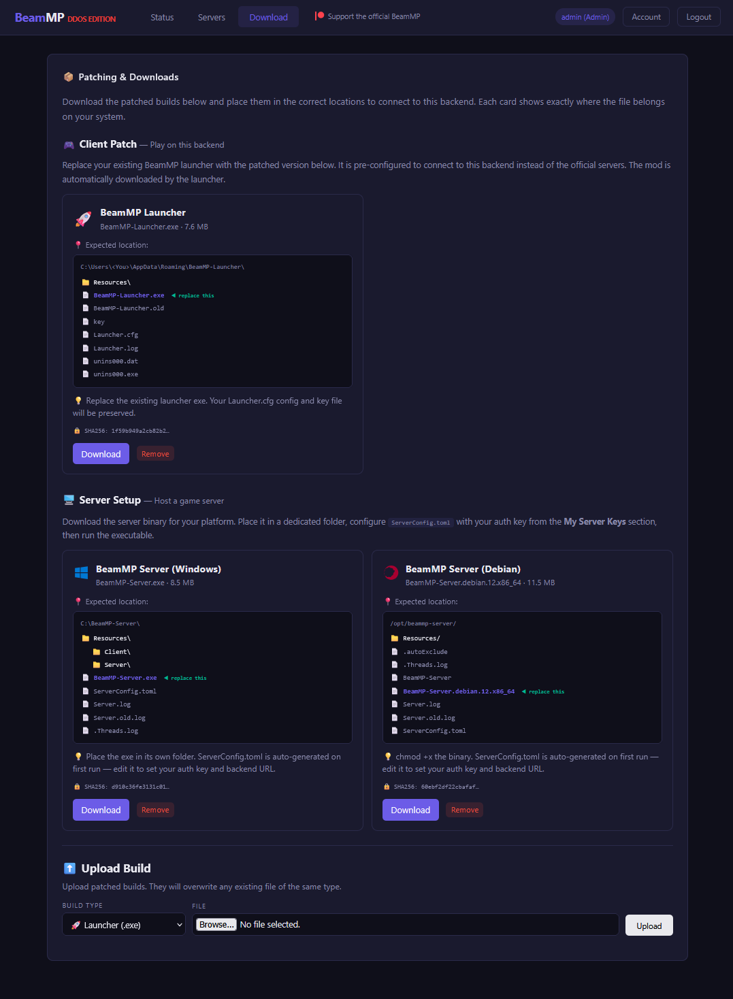
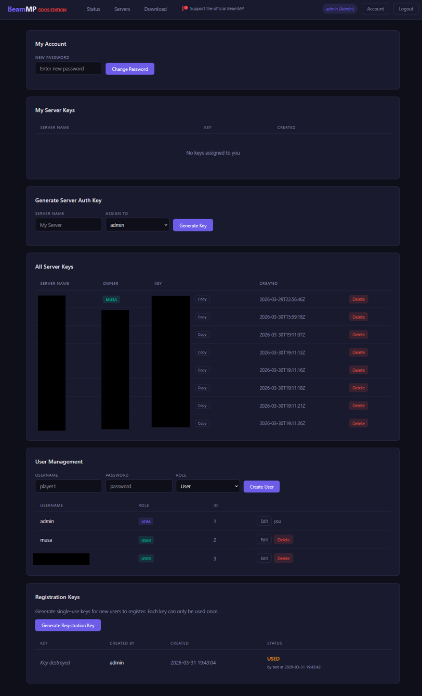

# Decentralized-BMP

A fully self-hosted, decentralized multiplayer backend for [BeamNG.drive](https://www.beamng.com/) using the [BeamMP](https://beammp.com/) mod. This project replaces the official BeamMP infrastructure (`backend.beammp.com` and `auth.beammp.com`) with a backend you own and control — pointing at **any** domain you choose.

> **No hardcoded domains.** Every component — launcher, game server, and backend — is configurable to communicate with any backend instance.

## Tested Versions

This project is tested and confirmed working with the following upstream BeamMP versions:

| Component | Upstream Version | Upstream Repository |
|---|---|---|
| BeamMP-Launcher | **2.7.0** | [BeamMP/BeamMP-Launcher](https://github.com/BeamMP/BeamMP-Launcher) |
| BeamMP-Server | **3.9.1** | [BeamMP/BeamMP-Server](https://github.com/BeamMP/BeamMP-Server) |

Other versions may work but have not been validated. The backend version-check responses are configurable via `LAUNCHER_VERSION` and `SERVER_VERSION` environment variables.

## Validated Environments

- **Backend Docker container** — Tested and validated on **Unraid 7.1.4**.
- **Debian game server** — The Linux server binary (`BeamMP-Server.debian.12.x86_64`) has been validated running inside an **AMP Docker container on Unraid 7.1.4**.

## Scaling Advisory

This project is designed for **self-hosted backends** with a small, trusted group of players. The workflow for admitting new users, assigning server keys, and generating user tokens reflects that — it assumes the backend operator knows who their users are.

While security is a priority in this implementation, running a backend open to hundreds of unknown users may pose risks with the current SQLite database structure. For that wider use case, the following hardening is recommended:

- **Separate domains** for the public-facing API and private admin interface
- **Further compartmentalization** of authentication tokens and session management
- **A dedicated database** (e.g., PostgreSQL) in place of SQLite for concurrent write performance and row-level security

## Overview

| Component | Language | Description |
|---|---|---|
| [backend/](backend/) | Python (FastAPI) | Self-hosted API server — handles auth, server list, heartbeats, mod distribution, and web dashboard |
| [BeamMP-Launcher/](BeamMP-Launcher/) | C++ | Modified launcher that reads `BackendUrl` from config instead of using hardcoded endpoints |
| [BeamMP-Server/](BeamMP-Server/) | C++ | Modified game server that reads `BackendUrl` from config / env var |
| [releases/](releases/) | — | Pre-packaged release bundles with configs and binaries |
| [legal/](legal/) | — | AGPL-3.0 compliance documentation and third-party notices |

## Web UI Screenshots

The backend includes a built-in web dashboard for login, live server status, player counts, and patched build downloads.

> Place the UI images in `docs/screenshots/` using the filenames below to have them render on GitHub.

### Login Screen



### Status Dashboard



### Downloads / Patching Page



### Admin Controls



## Quick Start

### 1. Deploy the Backend

```bash
cd backend
cp .env.example .env
# Edit .env — set ADMIN_KEY and ALLOWED_ORIGINS to your domain
docker compose up -d --build
```

The backend runs on port **8420** by default. Set up a reverse proxy (Caddy, nginx, Traefik) with TLS to expose it at your domain. This will work behind a Cloudflare proxy on top.

### 2. Configure the Launcher

Edit `Launcher.cfg` (created on first run, or copy from `releases/`):

```json
{
    "Port": 4444,
    "Build": "Default",
    "BackendUrl": "https://backend.yourdomain.xyz"
}
```

### 3. Configure the Game Server

Edit `ServerConfig.toml`:

```toml
[General]
AuthKey = "your-server-auth-key"
BackendUrl = "https://backend.yourdomain.xyz"
```

Or set the environment variable:

```bash
export BEAMMP_BACKEND_URL=https://backend.yourdomain.xyz
```

### 4. Get a Server Auth Key

1. Open the web dashboard at `https://backend.yourdomain.xyz`
2. Log in (default: `admin` / `changeme` — **change this immediately**)
3. Go to **Server Keys** and generate a new key
4. Paste the key into your `ServerConfig.toml` as `AuthKey`

## Configuration Reference

All three components accept a configurable backend URL:

| Component | Config File | Key | Env Var | Default |
|---|---|---|---|---|
| Launcher | `Launcher.cfg` | `BackendUrl` | — | `https://backend.yourdomain.xyz` |
| Server | `ServerConfig.toml` | `BackendUrl` | `BEAMMP_BACKEND_URL` | `https://backend.yourdomain.xyz` |
| Backend | `.env` | `ALLOWED_ORIGINS` | `ALLOWED_ORIGINS` | `https://backend.yourdomain.xyz` |

> **Important:** The `ALLOWED_ORIGINS` value on the backend must match the origin that browsers/clients connect from (your domain with scheme). Multiple origins can be comma-separated.

## Architecture

```
┌──────────────┐         ┌──────────────┐
│  BeamMP       │  HTTP   │   Backend    │
│  Launcher     │────────▶│  (FastAPI)   │
│               │         │              │
│  BackendUrl ──┘         │  /userlogin  │
│                         │  /servers-info│
│                         │  /builds/*   │
└──────────────┘         └──────┬───────┘
                                │
┌──────────────┐                │
│  BeamMP       │  HTTP         │
│  Game Server  │────────▶──────┘
│               │
│  BackendUrl ──┘  /heartbeat
│                  /pkToUser
└──────────────┘
```

**Backend endpoints:**

| Endpoint | Method | Purpose |
|---|---|---|
| `/userlogin` | POST | Player login (username/password or auto-login key) |
| `/pkToUser` | POST | Player authentication during server join |
| `/heartbeat` | POST | Server registration and keep-alive |
| `/servers-info` | GET | Server list for the launcher |
| `/builds/launcher` | GET | Launcher binary download |
| `/builds/client` | GET | Game mod download |
| `/v/s` | GET | Server version check |
| `/` | GET | Web dashboard UI |

## Building from Source

### Prerequisites

- **CMake** 3.16+
- **vcpkg** (included in `vcpkg/` — run `bootstrap-vcpkg.bat` or `bootstrap-vcpkg.sh`)
- **C++20 compiler** (MSVC 2022, GCC 11+, or Clang 14+)
- **Python 3.12+** and **Docker** (for the backend)

### Launcher (Windows)

```powershell
cd BeamMP-Launcher
cmake -B build -S . -DCMAKE_TOOLCHAIN_FILE=../vcpkg/scripts/buildsystems/vcpkg.cmake
cmake --build build --config Release
```

Output: `build/Release/BeamMP-Launcher.exe`

### Launcher (Linux)

```bash
cd BeamMP-Launcher
cmake -B build -S . -DCMAKE_TOOLCHAIN_FILE=../vcpkg/scripts/buildsystems/vcpkg.cmake
cmake --build build --config Release
```

### Game Server (Windows)

```powershell
cd BeamMP-Server
cmake -B build -S . -DCMAKE_TOOLCHAIN_FILE=../vcpkg/scripts/buildsystems/vcpkg.cmake
cmake --build build --config Release
```

Output: `build/Release/BeamMP-Server.exe`

### Game Server (Linux)

```bash
cd BeamMP-Server
cmake -B build -S . -DCMAKE_TOOLCHAIN_FILE=../vcpkg/scripts/buildsystems/vcpkg.cmake
cmake --build build --config Release
```

## Project Structure

```
Decentralized-BMP/
├── backend/                # FastAPI backend (Docker-ready)
│   ├── main.py             # API server
│   ├── index.html          # Web dashboard
│   ├── Dockerfile
│   ├── docker-compose.yml
│   ├── requirements.txt
│   └── .env.example
├── BeamMP-Launcher/        # Modified launcher source (C++)
│   ├── src/
│   │   └── Config.cpp      # BackendUrl config reading
│   ├── CMakeLists.txt
│   └── vcpkg.json
├── BeamMP-Server/          # Modified game server source (C++)
│   ├── src/
│   │   └── Settings.cpp    # BackendUrl setting
│   ├── CMakeLists.txt
│   └── vcpkg.json
├── releases/               # Packaged releases
│   └── v0.2.0/
├── builds/                 # Pre-compiled binaries
│   ├── windows/
│   └── linux/
├── legal/                  # License compliance docs
│   ├── COMPLIANCE.md
│   ├── THIRD-PARTY-NOTICES.md
│   └── README.md
└── vcpkg/                  # C++ package manager
```

## Data Storage

The backend stores all data under a single volume (`/data` in Docker):

| Data | Storage | Path |
|---|---|---|
| Users, keys, registration keys | SQLite | `/data/beammp.db` |
| Active servers | JSON (transient) | `/data/servers.json` |
| Server mods | Files | `/data/mods/{server_id}/` |
| Launcher/mod builds | Files | `/data/builds/` |

## Security Notes

- **Change the default admin password** (`admin` / `changeme`) immediately after first login.
- **Set a strong `ADMIN_KEY`** in your `.env` — this key is used for programmatic admin operations.
- **Use HTTPS** — the launcher and server communicate auth tokens over HTTP. Always place TLS termination in front of the backend.
- **`ALLOWED_ORIGINS`** restricts CORS. Set it to your actual domain to prevent cross-origin abuse.
- **SQLite is suitable for small deployments.** See [Scaling Advisory](#scaling-advisory) above if you plan to serve a large number of unknown users.

## License

The upstream BeamMP components (Launcher, Server, Lua mod) are licensed under **AGPL-3.0**. Modifications in this repository are distributed under the same license. The self-hosted backend (`backend/`) is original work.

See [legal/](legal/) for full compliance documentation, third-party notices, and the AGPL-3.0 obligations checklist.
